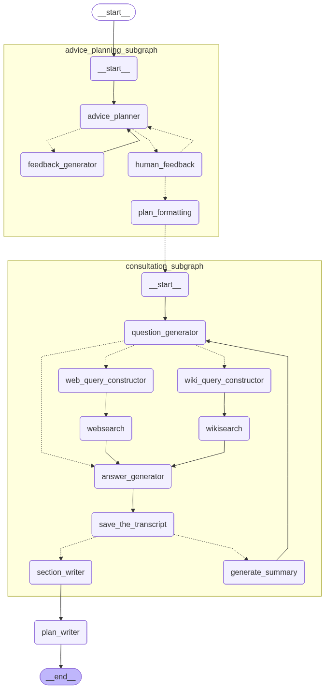

# 🧠 Multi-Agent Wellbeing Assistant

An autonomous LLM-based research assistant that generates personalised wellbeing action plans through intelligent multi-agent orchestration.

## Overview

This system uses a sophisticated multi-agent architecture to create customised wellbeing guidance based on user-reported problems. The output is a comprehensive, actionable document with evidence-based recommendations.

**Note:** This tool provides personalised wellbeing guidance, not medical advice.

## Technical Stack

- **Framework:** LangChain / LangGraph
- **LLMs:** GPT-4o (reasoning), GPT-4.1-mini (summarisation), GPT-5-mini (final output)
- **Search:** Tavily API, Wikipedia integration
- **Schema Validation:** Pydantic

## Key Features

### Intelligent Multi-Agent Architecture
- **Planning Stage** with two specialised LLM experts:
    - Planner agent for initial wellbeing plan generation
    - Feedback generator for critical evaluation and refinement (draft → refine cycle)
- **Consultation Stage** featuring simulated client-practitioner dialogues grounded in real-time research

### Human-in-the-Loop Design
- **Unlimited user feedback** iterations on the plan structure
- Interactive refinement before deep research begins

### Advanced Reasoning Frameworks
- **ReAct** (Reasoning + Acting) framework for decision-making
- **Chain-of-Thought** prompting for complex reasoning tasks
- **STORM-inspired** methodology for knowledge curation
    - Perspective-guided question generation
    - Dynamic source retrieval from web (Tavily API) and Wikipedia

### Performance Optimisation
- **Parallel execution** of consultation subgraphs for time efficiency
- **Map-reduce branching pattern** for dynamic processing of multiple plan steps
- Concurrent research across all action items
- Scalable architecture supporting variable plan complexity

### Context Engineering
- **Summarisation** for long conversation management
- Memory-efficient state management
- Preservation of critical-only information across multiple interaction cycles

## How It Works

1. User describes their wellbeing challenge 
2. System generates initial action plan with AI/human feedback loops
3. Each step undergoes deep research through simulated consultations
4. Final comprehensive Wellbeing Action Plan with actionable steps and cited sources is generated

## Architecture diagram

The system consists of two main subgraphs:
1. **Advice Planning Subgraph**: Generates and refines the wellbeing plan with AI/human feedback
2. **Consultation Subgraph**: Conducts research through simulated client-practitioner dialogues



## Setup

### Prerequisites
- Python 3.8+
- OpenAI API key
- Tavily API key (for web search)

### Installation

1. Clone the repository:
```bash
git clone https://github.com/lukasz-iskierka/multi-agent-wellbeing-assistant.git
cd wellbeing-assistant
```

2. Install dependencies:
```bash
pip install langchain langgraph langchain-openai langchain-tavily langchain-community pydantic python-dotenv
```

3. Create a `.env` file in the project root:
```env
OPENAI_API_KEY=your_openai_api_key
TAVILY_API_KEY=your_tavily_api_key
```

### Usage
```python

# Initialise with a problem description, e.g.:
problem = "I'm feeling very stressed at work because I don't like being surrounded by many people in an open office."

# Run the assistant
result = graph.invoke({
    "problem": problem,
    "max_steps": 3,  # Number of expected action plan steps
    "max_cycles": 2  # Optional: depth of research (default: 2)
})

# Display the personalised wellbeing plan
Markdown(result["final_plan"])
```

## Project Structure
```
multi-agent-wellbeing-assistant/
├── images/
│   └── architecture.png                # Architecture diagram 
├── notebooks/                
│   └── wellbeing_assistant.ipynb.py    # Development notebook
├── requirements.txt                    # Dependencies
└── README.md                           # Readme file
```

## License

MIT