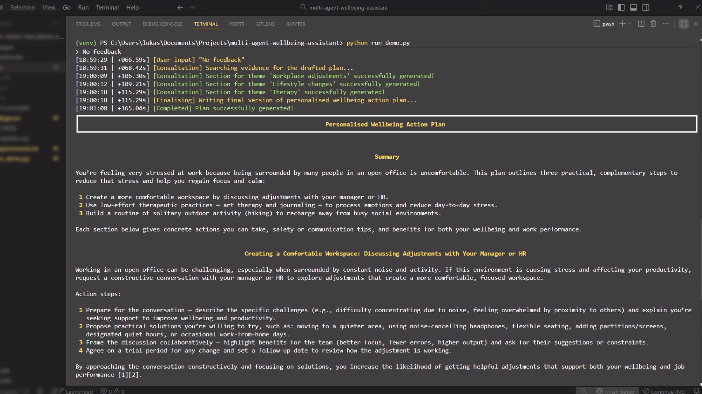
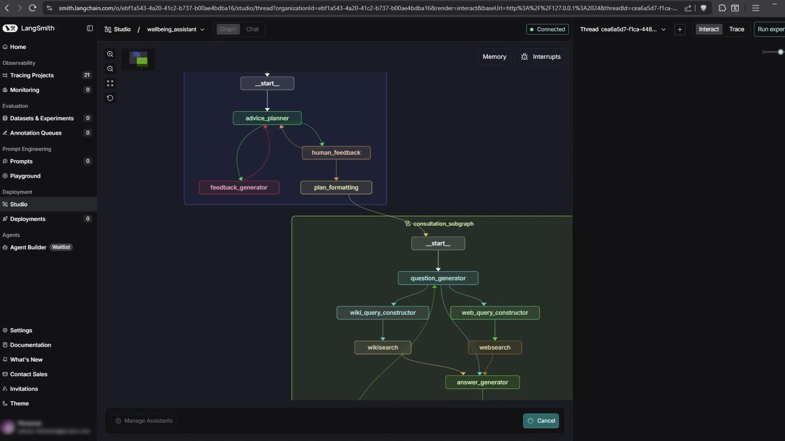
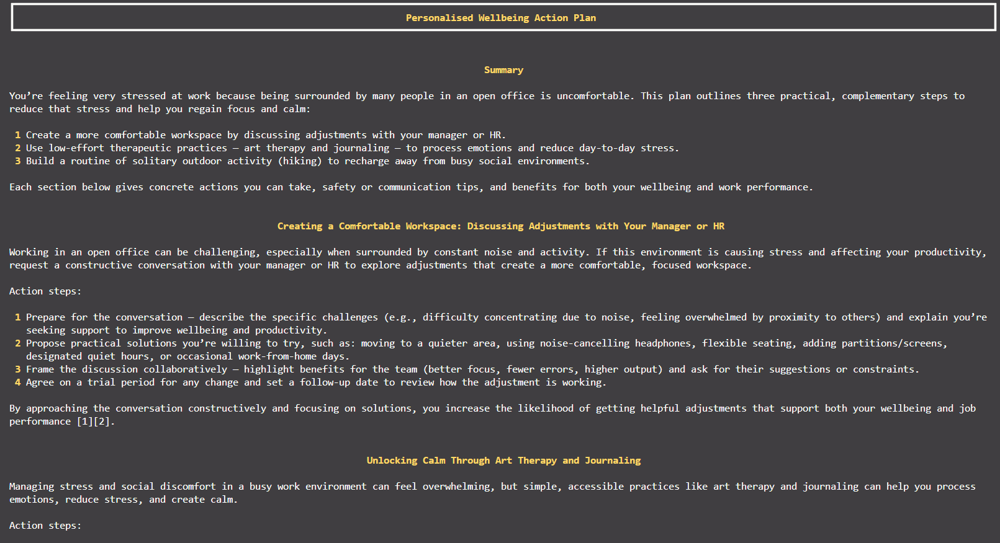
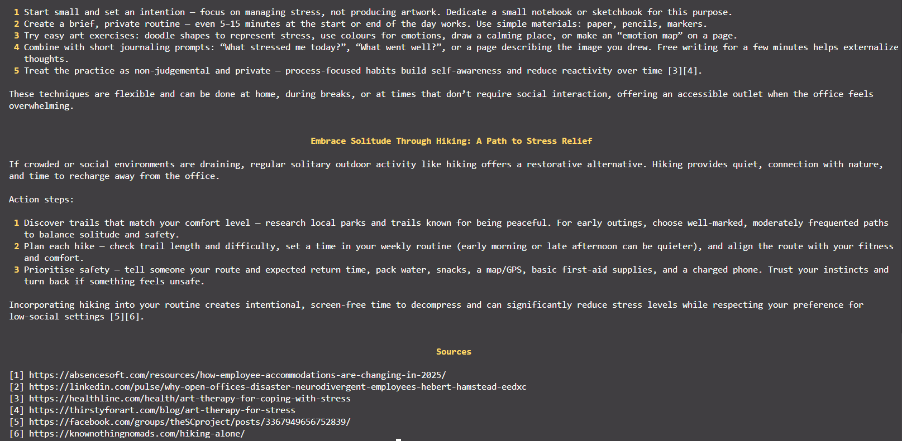

# 🧠 Multi-Agent Wellbeing Assistant

An autonomous LLM-based research assistant that generates personalised wellbeing action plans through intelligent multi-agent orchestration.

## Overview

This system uses a sophisticated multi-agent architecture to create customised wellbeing guidance based on user-reported problems. The output is a comprehensive, actionable document with evidence-based recommendations.

**Note:** This tool provides personalised wellbeing guidance, not medical advice.


## ⚙️ Technical Stack

- **Framework:** LangChain / LangGraph
- **LLMs:** GPT-4o (reasoning), GPT-4.1-mini (summarisation), GPT-5-mini (final output)
- **Search:** Tavily API, Wikipedia integration
- **Schema Validation:** Pydantic

## Key Features

### Intelligent Multi-Agent Architecture
- **Planning Stage** with two specialised LLM experts:
    - Planner agent for initial wellbeing plan generation
    - Feedback generator for critical evaluation and refinement (draft → refine cycle)
- **Consultation Stage** featuring simulated client-practitioner dialogues grounded in real-time research

### Human-in-the-Loop Design
- **Unlimited user feedback** iterations on the plan structure
- Interactive refinement before deep research begins

### Advanced Reasoning Frameworks
- **ReAct** (Reasoning + Acting) framework for decision-making
- **Chain-of-Thought** prompting for complex reasoning tasks
- **STORM-inspired** methodology for knowledge curation
    - Perspective-guided question generation
    - Dynamic source retrieval from web (Tavily API) and Wikipedia

### Performance Optimisation
- **Parallel execution** of consultation subgraphs for time efficiency
- **Map-reduce branching pattern** for dynamic processing of multiple plan steps
- Concurrent research across all action items
- Scalable architecture supporting variable plan complexity

### Context Engineering
- **Summarisation** for long conversation management
- Memory-efficient state management
- Preservation of critical-only information across multiple interaction cycles

## How It Works

1. User describes their wellbeing challenge
2. System generates initial action plan with AI/human feedback loops
3. Each step undergoes deep research through simulated consultations
4. Final comprehensive Wellbeing Action Plan with actionable steps and cited sources is generated

## Architecture diagram

The system consists of two main subgraphs:
1. **Advice Planning Subgraph**: Generates and refines the wellbeing plan with AI/human feedback
2. **Consultation Subgraph**: Conducts research through simulated client-practitioner dialogues


---

## 🎥 Demonstrations

### End-to-End Console Demo
A short video showing the **execution of `run_demo.py`** on a default input.  
The demo walks through major reasoning stages and displays the generated **Wellbeing Action Plan** rendered in Markdown directly in the terminal.

[](https://youtu.be/dCmZe2Gge10)

> *(Click the thumbnail to view the demo video on You Tube)*


### LangGraph Studio Walkthrough
A focused visualisation of the **LangGraph execution** for a single-step wellbeing plan.  
This video demonstrates how both subgraphs — the **Advice Planning** and **Consultation** graphs — interact within the main orchestration graph.

[](https://youtu.be/GcrD9ZLOIZg)

> *(Click the thumbnail to view the demo video on You Tube)*

### Example Output
Below is an example **Wellbeing Action Plan** generated by the system (run_demo.py) and rendered as Markdown in the console.




---

## Setup

### Prerequisites
- Python 3.9+  
- OpenAI API key  
- Tavily API key  

### Installation

1. Clone the repository:
```bash
git clone https://github.com/lukasz-iskierka/multi-agent-wellbeing-assistant.git
cd multi-agent-wellbeing-assistant
```

2. Install dependencies:
```bash
pip install -r requirements.txt 
```

3. Create a `.env` file in the project root:
```env
OPENAI_API_KEY=your_openai_api_key
TAVILY_API_KEY=your_tavily_api_key
```

### Usage

The demo entry point is `run_demo.py`, which runs the main LangGraph pipeline using default (or user-defined) input. This demo generates a three-step plan.
```python
python run_demo.py
```

## Project Structure
```
multi-agent-wellbeing-assistant/
├── images/
│   ├── architecture.png
│   ├── example_plan_part1.png
│   ├── example_plan_part2.png
│   ├── demo_video.mp4
│   ├── demo_thumbnail.png
│   ├── langgraph_demo.mp4
│   └── langgraph_thumbnail.png
├── notebooks/
│   └── wellbeing_assistant.ipynb               # Development notebooks
├── src/                                        # Application modules
│   ├── graphs/
│   │   ├── subgraphs/
│   │   │   ├── advice_planning_subgraph.py
│   │   │   └── consultation_subgraph.py
│   │   └── wellbeing_assistant_graph.py
│   ├── schemas/
│   │   ├── models.py
│   │   └── states.py
│   └── utils/
│       └── logging_utils.py
├── requirements.txt                            # Dependencies
├── run_demo.py                                 # Demonstration file
└── README.md
```

## License

MIT